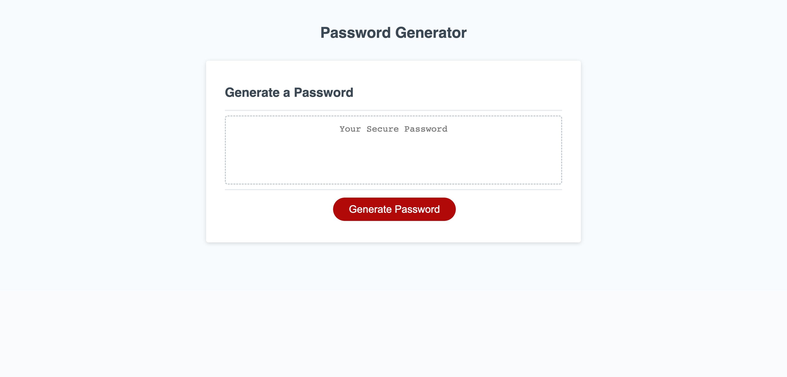

# Password Generator

## Description

This web application was built to help users generate a random password based off of a series of prompts. The prompts ask the user how many characters they'd like the password to be, as well as whether or not to include lowercase charactes, uppercase characters, numbers & special characters.

## Usage

For a user to successfully use this website they'll start by clicking on the 'Generate Password' button.

This will display 5 prompts for the user to help generate a password matching their needs:

1. Number of Characters - Provide how long the user would like the password to be [8-128 characters]
2. If they'd like to include Lowercase Letters
3. If they'd like to include Uppercase Letters
4. If they'd like to include Numbers
5. If they'd like to include Special Characters

Once they've completed these 5 prompts, a generated password will pop up in an alert!

## Credits

N/A

## Website URL
https://wyattbensman.github.io/password-generator/
